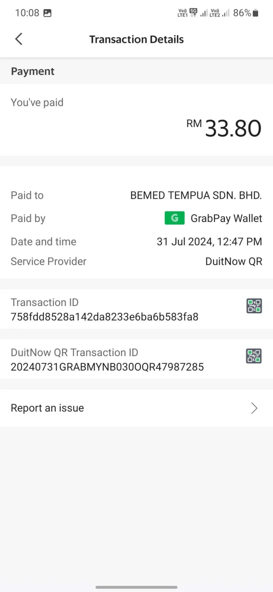
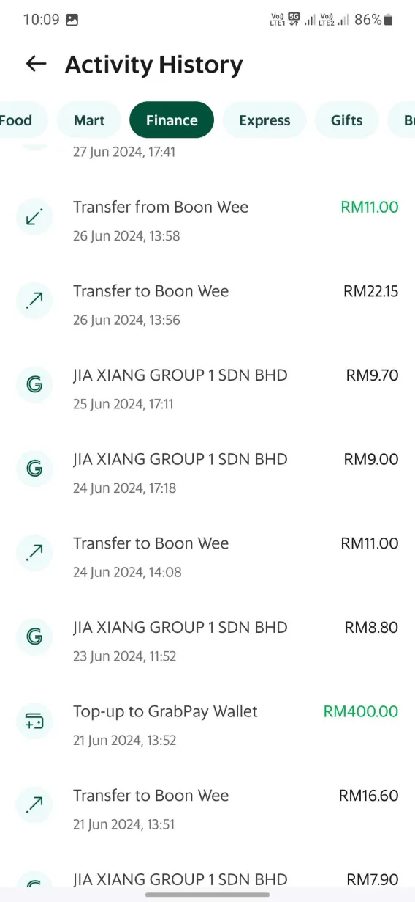
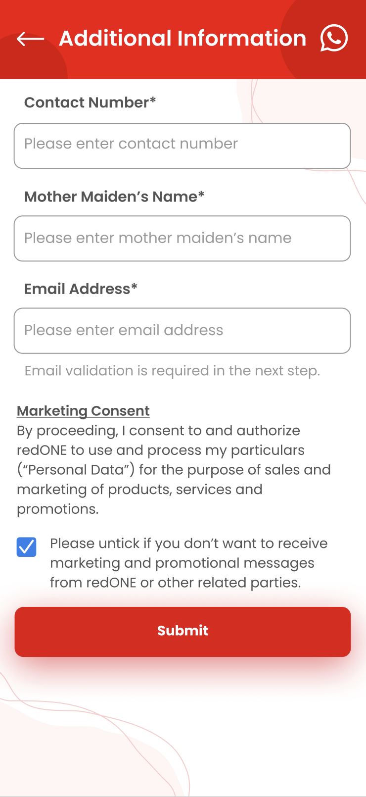
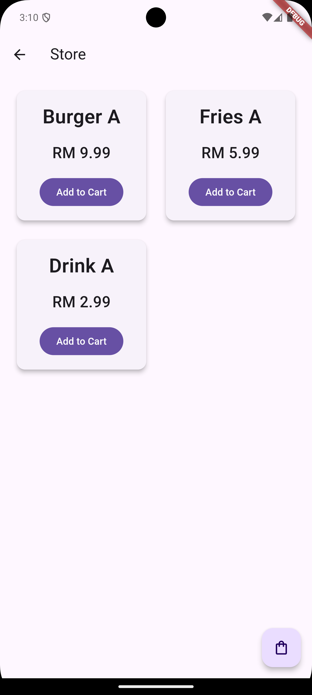
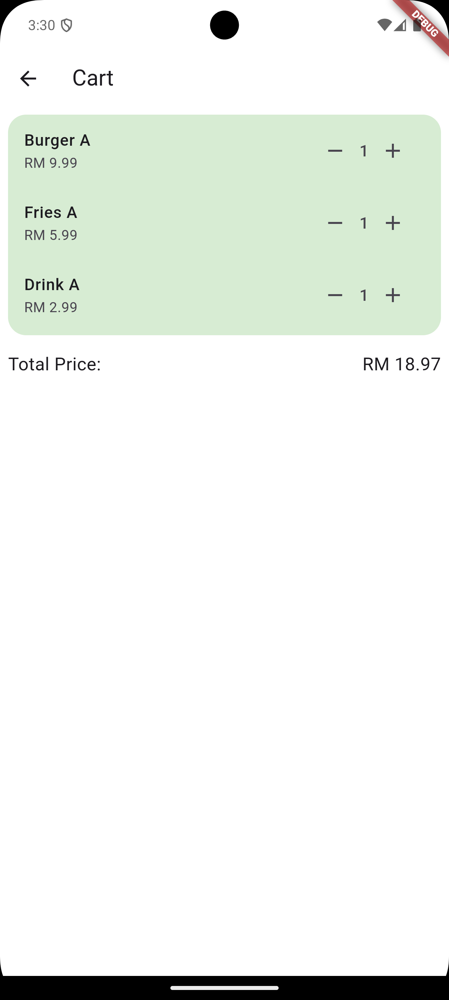
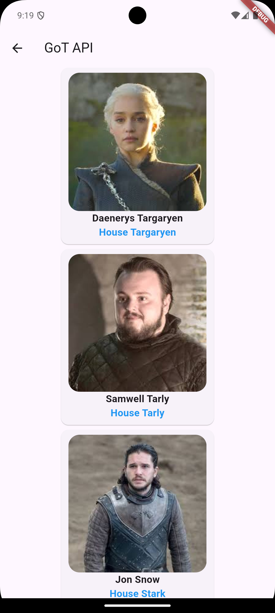

# Stateless Widgets
1. Create a new Flutter project
2. Develop the UI shown
3. Special icons can be replaced with any similar Material Icons provided in Flutter
## Exercise 1

## Exercise 2
*Create this page without the **filter buttons row** 

## Exercise 3
*Create this page without the **Marketing Consent** 

---
# Stateful Widgets
## Exercise 1

## Exercise 2

---
# Navigator
## Exercise 1
Display a confirmation page after the user submitted the Additional Information form. Show the content submitted by user on the confirmation page.

---
# Theme
## Exercise 1
Add a button to allow user to switch between dark and light theme. Keep the selected theme after user had killed the app.

Hint:
[Shared Preferences](https://pub.dev/packages/shared_preferences)

---
# State Management
Complete the exercise with **Provider**.

## Exercise 1
1. User add an item into shopping cart.
2. Show the items and total price in shopping cart screen.
3. Update total price based on the products in cart.

---
# Network (API)
**Prerequisite**
1. Goes through tutorial from [Flutter Networking Guide](https://docs.flutter.dev/get-started/fwe/networking)

Call API and show the information and image to user.

API: [GameOfThronesAPI](https://thronesapi.com/swagger/index.html?urls.primaryName=Game%20of%20Thrones%20API%20v2)

---

