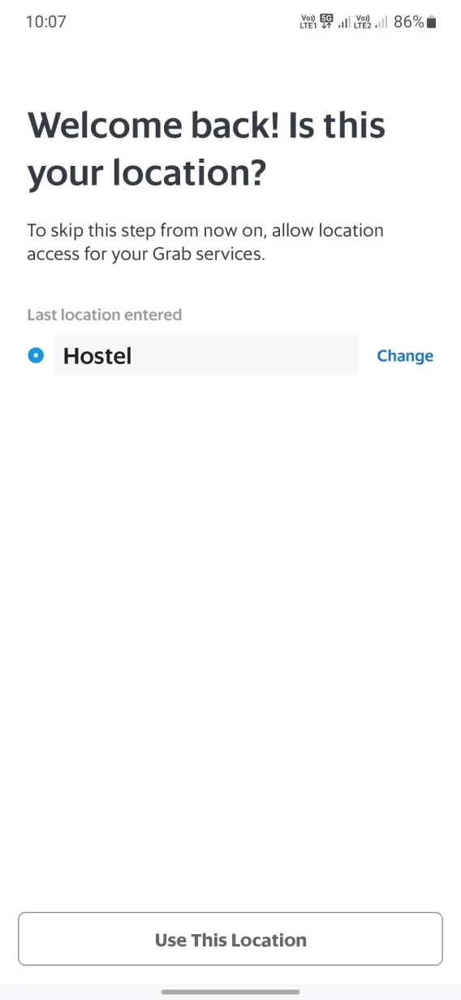
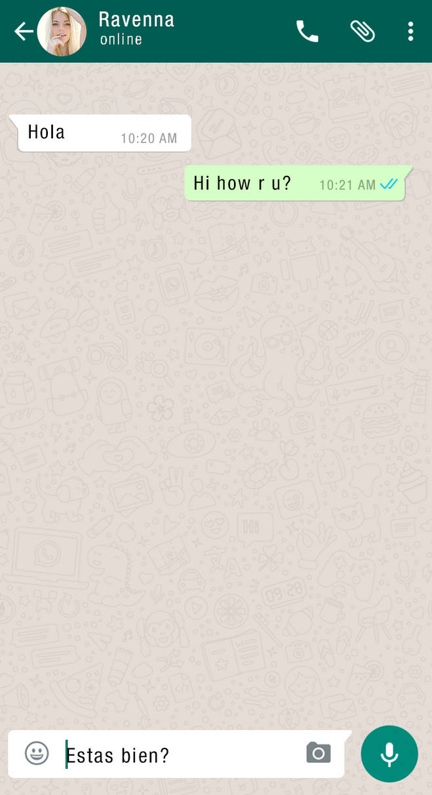
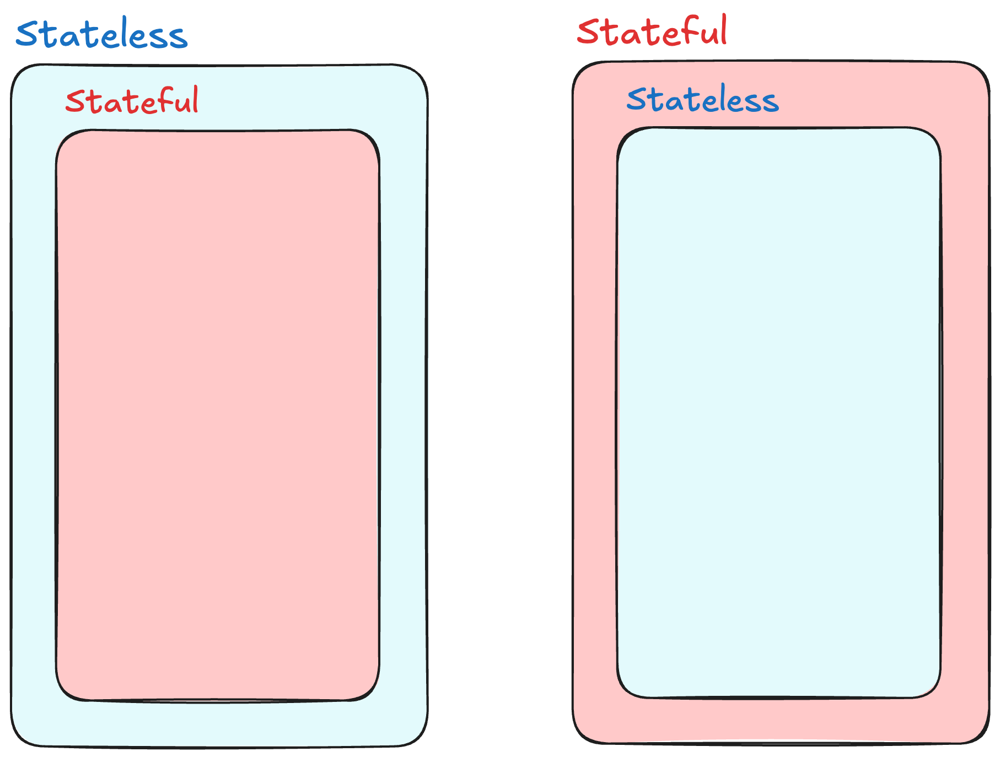
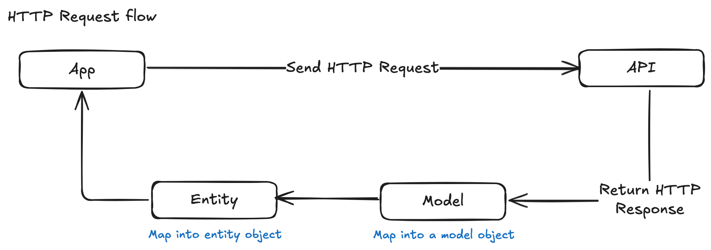

# Flutter
Flutter is 
1. a multi-platform / cross-platform developement framework
2. a UI toolkit. 
3. use alongside with Dart.

```
class UserCard extends StatelessWidget {
  final String name;
  final String bio;
  final String profilePictureUrl;

  const UserCard({
    super.key,
    required this.name,
    required this.bio,
    required this.profilePictureUrl,
  });

  @override
  Widget build(BuildContext context) {
    return Card(
      elevation: 5,
      margin: const EdgeInsets.all(16),
      shape: RoundedRectangleBorder(
        borderRadius: BorderRadius.circular(10),
      ),
      child: Row(
        children: <Widget>[
          Padding(
            padding: const EdgeInsets.all(16.0),
            child: CircleAvatar(
              backgroundImage: NetworkImage(profilePictureUrl),
              radius: 40,
            ),
          ),
          Expanded(
            child: Padding(
              padding: const EdgeInsets.all(16.0),
              child: Column(
                crossAxisAlignment: CrossAxisAlignment.start,
                children: <Widget>[
                  Text(
                    name,
                    style: const TextStyle(
                      fontSize: 18,
                      fontWeight: FontWeight.bold,
                    ),
                  ),
                  const SizedBox(height: 8),
                  Text(
                    bio,
                    style: TextStyle(
                      fontSize: 14,
                      color: Colors.grey[600],
                    ),
                  ),
                ],
              ),
            ),
          ),
        ],
      ),
    );
  }
}
```
---
# Dart
Dart is 
1. a strongly typed language
2. object-oriented
3. asynchronous
4. supports hot reload

*Dart’s syntax is similar to other C-style languages like JavaScript, Java, or C#.*

Quick Dart Guide:
[LearnXinYminutes](https://learnxinyminutes.com/docs/dart/)

```
enum TranslationLocale { en, zh, ms }

const Map<TranslationLocale, int> translationLocaleIndex = {
  TranslationLocale.en: 0,
  TranslationLocale.zh: 1,
  TranslationLocale.ms: 2,
};

const List<String> translationLocaleString = [
  "English",
  "中文",
  "Bahasa Melayu",
];

const Map<TranslationLocale, String> translationLocaleMap = {
  TranslationLocale.en: "English 🇬🇧",
  TranslationLocale.zh: "中文 🇨🇳",
  TranslationLocale.ms: "Bahasa Melayu 🇲🇾",
};

class Translation {
  final String key;
  final String value;

  Translation({
    required this.key,
    required this.value,
  });

  // For exporting purposes
  factory Translation.fromJson(Map<String, dynamic> json) => Translation(
        key: json["Key"],
        value: json["Value"],
      );

  Map<String, dynamic> toJson() => {
        "Key": key,
        "Value": value,
      };
}

class TranslationList {
  final List<Translation> list;

  TranslationList({
    required this.list,
  });
}
```

---
## Widget
**Everything is a widget.** A Widget is the building blocks of Flutter UIs. Widgets are build in a hierarchy pattern AKA widget tree. Practice <u>widget abstraction</u> whenever possible.

widget abstraction
 : <i>Abstract a widget from widget tree and make it reusable. This will also improve the readability of widget tree</i>

Most common widgets: *ListView, Column, Row, Text, Button, Padding, Container, Icon...*

Catalog:
[Basic](https://docs.flutter.dev/ui/widgets/basics)
[Input](https://docs.flutter.dev/ui/widgets/input)
[Layout](https://docs.flutter.dev/ui/widgets/layout)
[Scrolling](https://docs.flutter.dev/ui/widgets/scrolling)
[Styling](https://docs.flutter.dev/ui/widgets/styling)
[Text](https://docs.flutter.dev/ui/widgets/text)


References:
[TextStyle](https://api.flutter.dev/flutter/painting/TextStyle-class.html)
[TextButton](https://api.flutter.dev/flutter/material/TextButton-class.html)
[GesutreDetector](https://api.flutter.dev/flutter/widgets/GestureDetector-class.html)




<br><br>

#### Types of Widgets
1. Stateless Widget
    Stateless widgets are immutable. Once they are built, their state cannot change.
    *E.g. Text, App Bar, Basic Button*
2. Stateful widgets can change their state during the app’s lifecycle. Responsive to user actions and other events.
    *E.g. Forms, Filter Buttons, Video Player*

*note: stateless widget and its data will still be mutated if its parent widget mutate.*



<br>Try to keep stateful widget as <u>small</u> as possible to reduce complexity. 

small
 : <i>the responsibility of the widget is minimal</i>

---
## Navigation

<u>**Navigator 1.0**</u>
Navigator 1.0 is simple and suitable for most apps. Navigate between screens with `push` and `pop`.
```
Navigator.of(context).push(
  MaterialPageRoute(
    builder: (BuildContext context) => HomeScreen(),
  ),
);
```
`Navigator.of(context).pop()`


<u>**Go Router**</u>
Go Router is one of the many navigation packages in Flutter. This is also what we are using in our projects, with some modifications. Firstly, We declares the routes by creating a `GoRoute` in the `GoRouter` Widget. 
```
/// The route configuration.
final GoRouter _router = GoRouter(
  routes: <RouteBase>[
    GoRoute(
      path: '/',
      builder: (BuildContext context, GoRouterState state) {
        return const HomeScreen();
      },
      routes: <RouteBase>[
        GoRoute(
          path: 'details',
          builder: (BuildContext context, GoRouterState state) {
            return const DetailsScreen();
          },
        ),
      ],
    ),
  ],
);

/// The main app.
class MyApp extends StatelessWidget {
  /// Constructs a [MyApp]
  const MyApp({super.key});

  @override
  Widget build(BuildContext context) {
    return MaterialApp.router(
      routerConfig: _router,
    );
  }
}
```

Navigate to another route with `context.go('/')`, return to previous route with `context.pop()`.

#### Pass Value to another route
<u>**Navigator 1.0**</u>
```
Navigator.of(context).push(
  MaterialPageRoute(
    builder: (BuildContext context) => HomeScreen(
      person: Person(
        id: "1",
        name: "Alex",
      ),
    ),
  ),
);
```

<u>**Go Router**</u>
```
context.go(
  '/',
  extra: Person(
    id: '1',
    name: 'Alex',
  ),
);
```

#### Access the value from another route
<u>**Navigator 1.0**</u>
```
/// Stateless
class HomeScreen extends StatelessWidget {
  final Person person;

  const HomeScreen({
    super.key,
    required this.person,
  });

  
  @override
  Widget build(BuildContext context) {
    return Text("Name: ${person.name}");
  }
}


/// Stateful
class HomeScreen extends StatefulWidget {
  final Person person;

  const HomeScreen({
    super.key,
    required this.person,
  });

  @override
  _HomeScreenState createState() => _HomeScreenState();
}

class _HomeScreenState extends State<HomeScreen> {
  @override
  Widget build(BuildContext context) {
    return Text("Name: ${widget.person.name}");
  }
}

```

<u>**Go Router**</u>
Need to declare it in the `GoRouter` widget.
```
GoRoute(
  path: '/',
  builder: (context, state) {
    // Retrieve the extra data
    final Person person = state.extra as Person;
    return HomeScreen(person: person);
  },
),

/// Same as Navigator 1.0
```

Refrence:
[Go Router](https://pub.dev/packages/go_router)

## Theme
Flutter default to Material3 theme, some of the Cupertino (iOS) styled widgets are support by Flutter team. Theme customization can be done in the `MaterialApp` Widget.

Reference:
[Cupertino Widget](https://docs.flutter.dev/ui/widgets/cupertino)
[Theme Customization Preview](https://appainter.dev/)

---
## State Management
State management in Flutter is about how your app handles and updates its <u>state</u>. For example, it could be user input, network responses, or data from a database. 

State Management is needed when a state from a part of the app is also used in other parts. For example, in a food delivery app, the checkout screen would need to know if user chosen delivery or pick up, in order to calculate the total price.

state
  : the information or data that influences the app’s behavior and appearance

There are many State Management approaches, but here are some of the more popular options:
1. [Providers](https://pub.dev/packages/provider)
2. [BLoC (Business Logic Component)](https://pub.dev/packages/bloc)
3. [Riverpod](https://pub.dev/packages/riverpod)

Refrence:
[InheritedWidget](https://docs.flutter.dev/get-started/fwe/state-management#using-inheritedwidget)

---

## Networking (API)
We need to handle each state of the API call, the **Loading** state, **Empty** state, and **Data** state.



### Mapping
In dart there is no built-in encoder/decoder for JSON. So we will have to prepare it for every class that needed to encode to JSON or decode from JSON.

Normally we will have an object what we use to map the response coming from API. Every fields of this object will be nullable. 

After creating the object that is based on API response, we will create an object that is cater for the App's usage. It will remove unnecessary fields and also allow you to rename the fields if needed.


### Model
```
class PlanResponse {
  final String? projectId;
  final String? projectName;
  final String? planId;
  final String? planName;
  final num? planPrice;
  final bool? isActive;

  PlanResponse({
    required this.projectId,
    required this.projectName,
    required this.planId,
    required this.planName,
    required this.planPrice,
    required this.isActive,
  })

  // .fromJson
}
```

### Entity
```
class Plan {
  final String projectId;
  final String projectName;
  final String id;
  final String name;
  final double price;
  final bool isAvailable;

  Plan({
    required this.projectId,
    required this.projectName,
    required this.id,
    required this.name,
    required this.price,
    required this.isAvailable,
  })

  // .toJson
}
```

---
